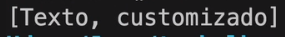

# Trabalhando com Strings

## Referência: Curso de Desenvolvimento Java, Giuliana Silva Bezerra
[Compre aqui](https://www.udemy.com/course/curso-de-desenvolvimento-java/)

## Tópicos

- [Pool de Strings](#pool-de-strings)
- [Imutabilidade das Strings](#imutabilidade-das-strings)
- [Strings são Arrays de Caracteres](#strings-são-arrays-de-caracteres)
- [Acessando um Caractere Específico em String](#acessando-caracteres-específicos-na-string)
- [Capitalizando uma String (Upper e Lower case)](#capitalizando-uma-string)
- [Dividindo String em Palavras .split()](#dividindo-string-em-palavras)
- [Conversão em Tipos .valueOf()](#conversão-entre-tipos)
- [Concatenação com StringBuilder](#concatenação-com-string-builder)
- [Formatação de String Complexas](#formação-de-string-complexas)

Podemos inicializar uma String de duas formas:

Declarando normalmente, ou usando new String("string desejada").

## Pool de Strings

Nós sabemos que o Java é uma linguagem que se preocupa com perfomance (principalmente da JVM).

Quando criamos uma String da primeira maneira, a partir do momento que criamos ela fica dentro de um container.
E se for eventualmente declarada uma String com o mesmo nome, ela irá apontar diretamente para esse container.

Então ao invés de ficar instanciando novas Strings (com new) e alocando esses novos objetos em outro endereço
e alocando espaço na memória, a gente só reusa os objetos que estão na Pool de Strings.

## Imutabilidade das Strings

Caso a gente comparar as duas Strings criadas acima (com "==", será false. O motivo é que a new String está alocado 
em outro espaço de memória.

Mas se compararmos com ".equals", será true. **Pois o conteúdo é igual!**

Cabe destacar, que se tiver por exemplo duas variáveis com o mesmo conteúdo e comparar com "==", será true.

Isso se chama **Imutabilidade**. Se a gente compartilha informação de uma variável para outra, nós não podemos 
mudá-la.

Se a gente muda para outra variável (como texto1 pra texto2), a gente muda também o endereço de memória do texto1.
Ele passará a ser igual ao do texto2.

Esse é o "problema" do pool de strings. Ele armaneza as coisas em memória para reuso mas não permite a mutabilidade
dessas Strings.

## Strings São Arrays de Caracteres

As Strings possuem VÁRIOS métodos. Um deles é o ".toCharArray". É bacana a gente saber as Strings são, na verdade,
Arrays de caracteres. 

E caso quiséssemos, por exemplo, percorer uma String e ver se ela possui uma letra específica, faríamos isso:

Inserir essa string.toCharArray() dentro de uma variável char[] e percorre-la.

## Acessando Caracteres Específicos na String

Nós podemos também acessar uma posiçaõ específica da String, pois como ela é uma Array, ela possui um index.

Para imprimir a primeira letra de um texto, usando ".charAt())" por exemplo:

## Capitalizando uma String

Nós podemos transformar uma string toda em maiúscula ou minúscula, utilizando ".toUpperCase()" e ".toLowerCase()",
respectivamente.

Essas métodos não modificam uma string, e sim retornam uma **nova string**.

## Dividindo String em Palavras

Podemos descobrir o numero de palavras que a String possui. Para isso utilizamos o método ".split()".

Nós dividimos a String, tirando o seu espaço com " ". Isso retorna um Array de Strings, por isso alocamos
esse retorno a uma [].

E como é um array, pra imprimirmos usamos o SOUT com ".toString".

Retorno: 

E daí é possivel realizar um for each para percorrer esse Array.

## Conversão entre Tipos

É comum acessarmos algo de um cliente por exemplo e o programa salvou idade como String. Mas precisamos converter
ele em um número.

Para converter podemos usar **valueOf**.

String para Int - Integer.valueOf(String):

O mesmo para outros tipos. (String.valueOf, Double.valueOf()).

## Concatenação com String Builder

É muito comum criarmos String concatenadas com várias expressões:

Isso não é bom, não fica legível, é muitas strings para gerenciar e tem alternativas mais elegantes.

Uma delas é usar o StringBuilder. Primeiro, instanciamos ele:

Depois, usamos seu método ".append()", passando todas as palavras:

No final teremos uma String concatenada com todas essas palavras.

**Para visualizar, só dar SOUT no (builder.toString()).**

## Formação de String Complexas

Essa era a forma que concatenávamos variáveis com String antes:

E como já foi dito acima. Isso não é bacana e nem muito legível.

Para montar uma String da forma correta, usaremos os especificadores (igual ao printF).

Tudo que for a variável (nome, username... usaremos "%s"). E para substituir, usaremos o .formatted na ordem que
quisermos.

E por fim, podemos escrever multiplas linhas usando 3 asplas duplas no incio e fim da variável.

